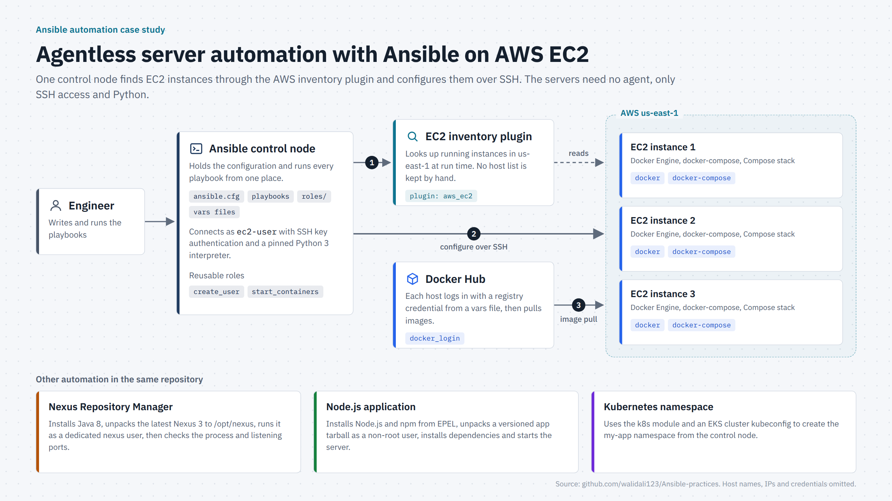
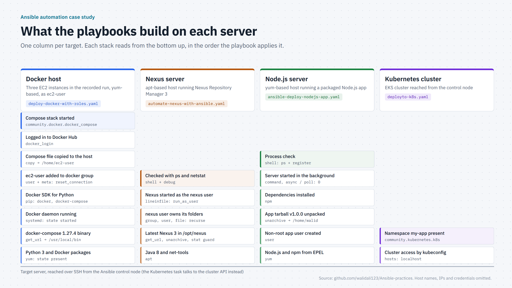
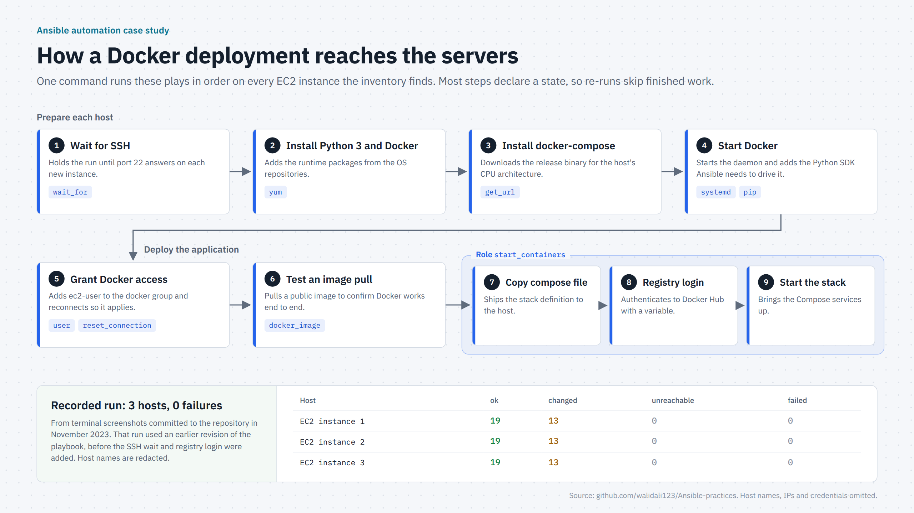
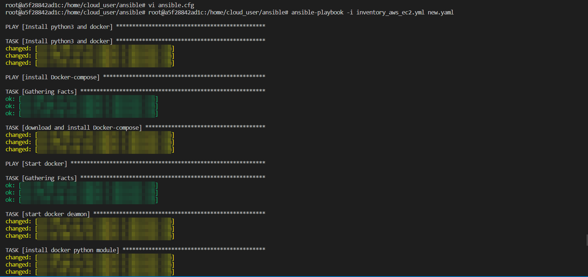
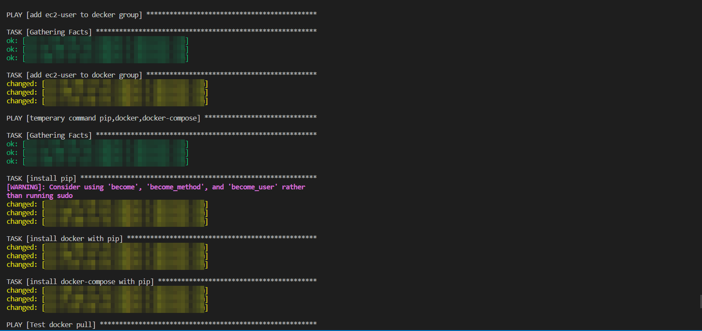
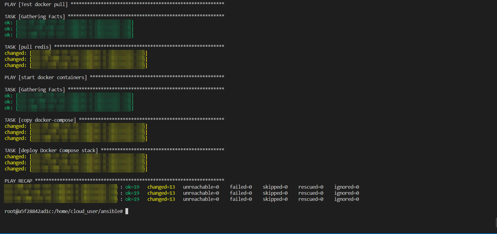

# Server Automation on AWS EC2 with Ansible

## Overview

This project automates the setup of Linux servers on AWS EC2 using Ansible. A single control node discovers running EC2 instances through the AWS dynamic inventory plugin and configures them over SSH, with no agent installed on the servers. The main workflow takes a fresh instance to a running Docker Compose stack: it installs Docker and docker-compose, starts the daemon, grants the deploy user access, logs in to Docker Hub and starts the containers. The same repository also automates a Nexus Repository Manager install, a Node.js application deployment, and namespace creation on an EKS Kubernetes cluster.

The scope is infrastructure automation. The applications being deployed were existing packages and images, not written as part of this work.

## Architecture

The engineer runs playbooks from the Ansible control node. The `aws_ec2` inventory plugin looks up running instances in `us-east-1` at run time, so there is no hand-maintained host list. Ansible then connects to each instance over SSH as `ec2-user` with key-based authentication. Each host authenticates to Docker Hub and pulls the images its Compose stack needs.

## CI/CD

This repository does not contain a CI/CD pipeline. Deployments are run from the Ansible control node with `ansible-playbook`. See Deployment Flow below.

## Infrastructure

Four target types are automated:

- **Docker hosts (EC2).** Python 3 and Docker from the OS repositories, the docker-compose 1.27.4 binary, the Docker daemon under systemd, the Docker SDK for Python, `ec2-user` in the `docker` group, then the Compose file, registry login and running stack.
- **Nexus server.** Java 8 and net-tools, the latest Nexus 3 release unpacked to `/opt/nexus`, a dedicated `nexus` user and group owning its folders, Nexus started as that user, and a check with `ps` and `netstat`.
- **Node.js server.** Node.js and npm from EPEL, a non-root application user, a versioned app tarball unpacked and its dependencies installed, and the server started in the background with a process check.
- **Kubernetes (EKS).** The `k8s` module, run from the control node with the cluster's kubeconfig, creates the `my-app` namespace.

## Deployment Flow

`deploy-docker-with-roles.yaml` runs nine steps in order on every discovered instance. It waits for SSH, installs Python 3 and Docker, installs docker-compose, starts Docker, grants Docker access to `ec2-user`, and tests an image pull. The `start_containers` role then copies the Compose file, logs in to Docker Hub and starts the stack.

Most tasks use declarative modules (`state: present`, `state: started`), and the Nexus playbook checks for an existing install before downloading, so running a playbook again does not repeat finished work.

## Proof of Execution

These terminal captures come from a real run of the Docker deployment playbook against three EC2 instances, using the dynamic inventory. Host names and IP addresses are blurred. The run used an earlier revision of the playbook, before the SSH wait and registry login steps were added.

**Installing Python 3, Docker and docker-compose, then starting the Docker daemon**

**Granting Docker access to ec2-user and installing the Docker SDK for Python**

**Test image pull, copying the Compose file, starting the stack, and the final recap: 3 hosts, 0 unreachable, 0 failed**

## Security

The playbooks follow a few sound practices. Services run as dedicated non-root users (`nexus`, and a separate application user for Node.js). Privilege escalation is scoped per play with `become` and `become_user`. SSH uses key-based authentication. Registry credentials are supplied as variables rather than written into tasks.

A separate security diagram is not included because the project does not have enough security configuration to support one. There is no TLS, secrets vault, firewall or network policy configuration.

## Technologies

- Ansible (playbooks, roles, dynamic inventory)
- AWS EC2 and the `aws_ec2` inventory plugin
- Docker and Docker Compose
- Docker Hub
- Kubernetes on Amazon EKS (`k8s` module)
- Sonatype Nexus Repository Manager 3
- Node.js and npm
- Linux: yum/EPEL and apt package management, systemd, user and group management
- SSH

## DevOps Responsibilities

- Wrote Ansible playbooks that provision Docker and docker-compose on EC2 instances and deploy a Docker Compose stack.
- Set up the AWS EC2 dynamic inventory plugin so target hosts are discovered at run time.
- Refactored the container deployment into reusable roles (`create_user`, `start_containers`) with defaults and variables.
- Automated authenticated image pulls from Docker Hub using variables.
- Automated a Nexus Repository Manager install with a dedicated service user and post-install verification.
- Automated a Node.js application deployment from a versioned release package, run as a non-root user.
- Used Ansible's Kubernetes module against an EKS cluster to manage namespaces.
- Debugged host-side issues during development, such as Python interpreter selection and Docker group membership needing a reconnect.

## Project Results

- The Docker playbook configured **three EC2 instances in a single run with 0 failed and 0 unreachable hosts**. See Proof of Execution above.
- Hosts are discovered automatically from AWS, so the same playbook applies to however many instances are running.
- Container deployment steps are packaged as a role that other playbooks can reuse.
- Service setup (Docker, Nexus, Node.js) is written down as code and can be repeated, replacing manual server configuration.
